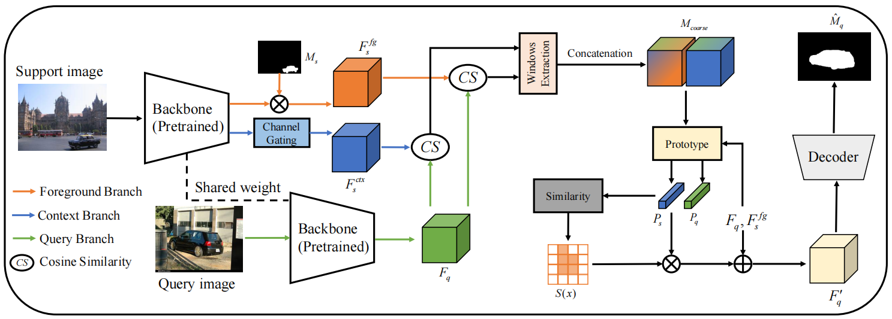
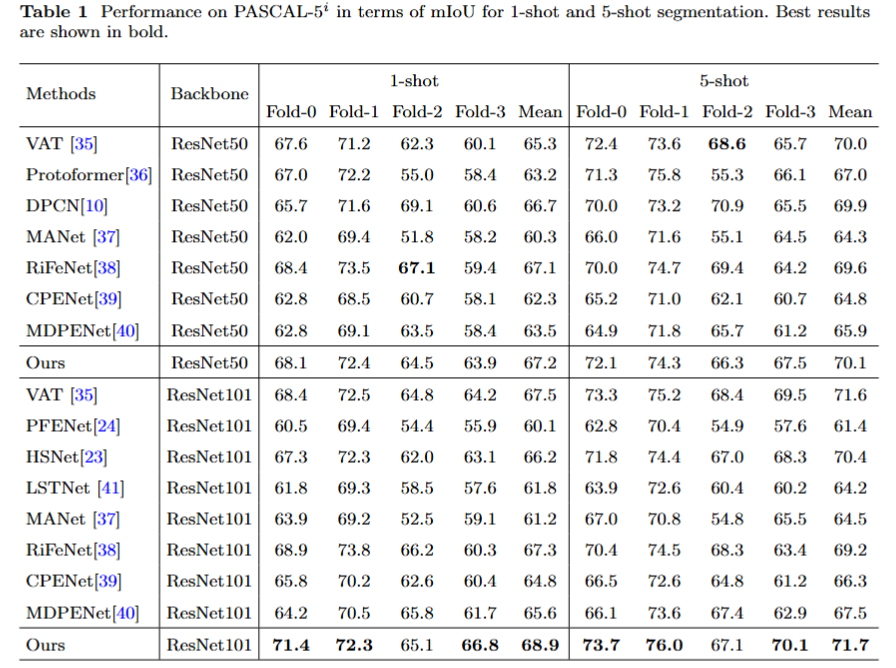
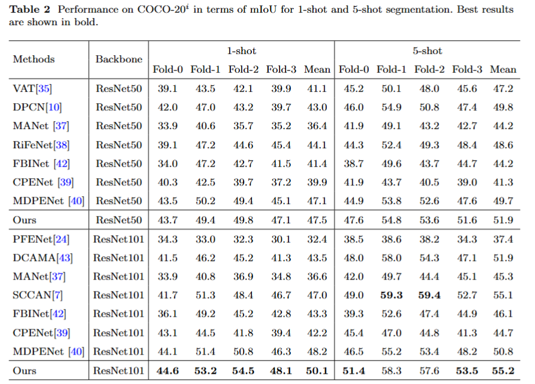
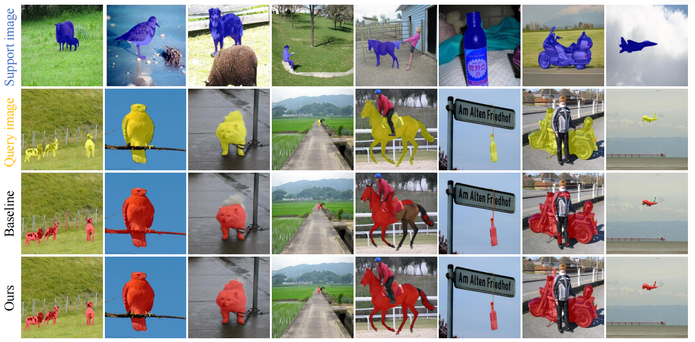

# SAPNet: Support-Aware Prototype Calibration Network for Few-Shot Semantic Segmentation

这是我们论文 "**SAPNet: Support-Aware Prototype Calibration Network for Few-Shot Semantic Segmentation**" 的官方代码实现。

> **Abstract**: Few-shot semantic segmentation suffers from limited support annotations, often leading to coarse localization and weak semantic representation. Existing methods either compress spatially rich features into static prototypes or rely heavily on masked regions, resulting in information loss and poor adaptability. To address this issue, we propose a **Support-Aware Prototype Calibration Network (SAPNet)**, which consists of a **Support Information Amplification Module (SIAM)** and an **Adaptive Cross-Prototype Calibration Module (ACPCM)**. SIAM preserves spatially detailed foreground structures while incorporating complementary contextual cues from the entire support image, and generates reliable coarse localization priors via multi-granularity similarity aggregation. Based on this prior, ACPCM constructs both support and query-aware prototypes and performs cross-prototype calibration with adaptive feature refinement, enabling dynamic semantic alignment while maintaining stable guidance from support features. Extensive experiments on the PASCAL-5^i and COCO-20^i benchmarks demonstrate consistent improvements over existing state-of-the-art methods.

----

## 🎨 Architecture Overview

<p align="center">
  
</p>

  - **SIAM**: 保持空间细节并放大支持集信息，生成高质量的粗略定位先验（Coarse Localization Priors）。
  - **ACPCM**: 通过自适应交叉原型校准（Cross-Prototype Calibration），动态精炼查询集特征，实现精准语义对齐。

-----

## 🛠 Dependencies

  - Python 3.8
  - PyTorch 1.7.0+
  - CUDA 11.0
  - torchvision 0.8.0

你可以使用以下命令快速同步环境：

```bash
conda env create -f env_sapnet.yaml
```

-----

## 📂 Datasets

本模型在以下两个基准数据集上进行评估：

  - **PASCAL-5^i**: [VOC2012](http://host.robots.ox.ac.uk/pascal/VOC/voc2012/) + [SBD](http://home.bharathh.info/pubs/codes/SBD/download.html)
  - **COCO-20^i**: [COCO2014](https://cocodataset.org/#download)

请确保你的数据目录结构如下：

```text
../
├── SAPNet/
└── data/
    ├── VOCdevkit2012/
    │   └── VOC2012/
    │       ├── JPEGImages/
    │       └── SegmentationClassAug/
    └── MSCOCO2014/           
        ├── annotations/
        ├── train2014/
        └── val2014/
```

-----

## 🧠 Models

  - **Pre-trained Backbones**: 下载预训练权重并放入 `initmodel` 文件夹。
  - **SAPNet Checkpoints**: 下载训练好的模型权重并解压至 `exp` 目录。

-----

## 🚀 Usage

通过修改 `config` 文件夹中的 `.yaml` 配置文件来调整实验参数。

### 1\. Meta-training

  - **PASCAL-5^i** (1/5-shot):
    ```bash
    CUDA_VISIBLE_DEVICES=0 python train.py --config=config/pascal/pascal_split{0,1,2,3}_resnet{50,101}{_5s}.yaml
    ```
  - **COCO-20^i** (1/5-shot):
    ```bash
    CUDA_VISIBLE_DEVICES=0,1,2,3 python -m torch.distributed.launch --nproc_per_node=4 --master_port=1234 train.py --config=config/coco/coco_split{0,1,2,3}_resnet{50,101}{_5s}.yaml
    ```

### 2\. Meta-testing

  - **1-shot**:
    ```bash
    CUDA_VISIBLE_DEVICES=0 python test.py --config=config/{pascal,coco}/{pascal,coco}_split{0,1,2,3}_resnet{50,101}.yaml
    ```
  - **5-shot**:
    ```bash
    CUDA_VISIBLE_DEVICES=0 python test.py --config=config/{pascal,coco}/{pascal,coco}_split{0,1,2,3}_resnet{50,101}_5s.yaml
    ```

-----

## 📈 Performance

SAPNet 在各个数据集上均达到了 SOTA 性能。

### 1\. PASCAL-5^i Result

<p align="center">
  
</p>

### 2\. COCO-20^i Result

<p align="center">
  
</p>

-----

## 🔍 Visualization

以下是 SAPNet 的定性分析结果，展示了 SIAM 如何捕捉精细的空间结构以及 ACPCM 如何校准预测偏差。

<p align="center">
  
</p>

